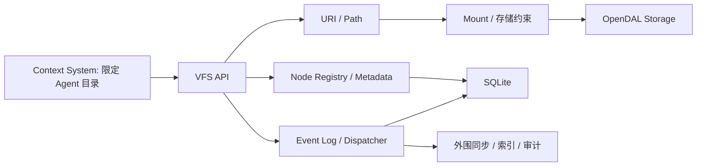

# Alcyone VFS 核心用例文档 v0.2

## 本次修改（2026-09-28，T03 审阅通过）

- 衔接已确认的状态与事务基线，明确懒注册与变更事件的提交规则。涉及文首衔接说明、UC-03、UC-07。

更新时间：2026-09-28  
状态：Draft；接口字段以 [公共契约草案](VFS_公共契约草案_v0.1.md) 为准。

[T02 文件操作语义](VFS_路径与文件操作语义_v0.1.md) 已获用户确认；本文中仍写作“由 T02 确定”的细节均以该基线为准，包括虚拟目录注册、自动创建父目录和挂载边界。事务与失败报告见已确认的 [T03 状态与事务设计](VFS_状态与恢复设计_v0.1.md)。

## 1. 文档目的

定义首阶段 VFS 用例的流程、异常、状态变化和事件，作为后续契约、实现及集成验收依据。VFS 提供统一文件系统能力，Agent 身份和数据归属由 Context System 处理。

## 2. 核心用例范围

| 用例 | 内容 |
| --- | --- |
| UC-01 | 读取文件 |
| UC-02 | 创建 / 写入文件 |
| UC-03 | Node 查询 / 懒注册 |
| UC-04 | 移动 / 重命名文件或目录 |
| UC-05 | 删除文件 / 目录 |
| UC-06 | Metadata 查询 / 更新 |
| UC-07 | VFS Event |

目录 list 作为基础查询单列在第 6.8 节，参与验收但不重编已有用例编号。Git Sync、Index、Audit 为外围 Consumer，不作为 Core 事务步骤；同步配置和 Runtime 接入按 E1 交付。

## 3. 参与者与模块

| 参与者 / 模块 | 职责 |
| --- | --- |
| Context System | 根据 Agent 的分配目录限定 URI，调用 VFS，不向 VFS 传身份 |
| VFS API / DefaultVfs | 公共文件操作与流程编排 |
| URI Resolver | URI 校验、得到 VfsPath |
| Node Registry | 按逻辑路径维护稳定资源身份及当前映射 |
| Metadata Manager | 按 Node ID 查询 / 更新描述信息 |
| Mount Resolver | 最长路径段前缀匹配，得到 Mount / StoragePath |
| Storage Adapter | 屏蔽 OpenDAL 后端能力与错误差异 |
| Event Log / Dispatcher | 持久化事件和进程内分发 |
| Event Consumer | 配置的同步、索引或审计扩展，独立重试 |

目录名按普通路径处理，返回的列表由 Context System 按其业务范围使用。

## 4. 统一文件访问规则

```text
VfsUri / 操作参数 → VfsPath → Mount / StoragePath → 存储约束 → Storage I/O
```

- 检查 URI / 路径边界、参数、类型、覆盖规则和后端能力。
- Context System 在进入 VFS 前限定 Agent 可访问的路径。
- Node Registry 按操作需要参与查询和更新，不要求普通文件已经注册。
- 已注册 Node / Metadata 查询只访问状态库，无需 Mount 或 Storage。
- 后端拒绝访问 / 凭据失败仍应明确报告为 Storage 错误，不伪装成成功。
- SQLite 事务不涵盖外部 Storage；部分完成与结果不明按 T03 报告 effect，首版不自动修复。

## 5. 模块交互概览



图为职责关系；按已确认的 T03，状态与事件同事务提交后分发，可靠消费延后。

## 6. 核心用例详情

### 6.1 UC-01 读取文件

**输入 / 输出**：read(uri, options) → ByteArray。

流程：

1. 解析 URI 和读取大小限制。
2. 路由 Mount，计算并验证 StoragePath。
3. 检查后端读取能力，通过 Adapter 执行读取。
4. 在读入过程中执行大小限制，返回内容。

异常：非法 URI、Mount Not Found、Not Found、类型错误、能力不足、大小超限、后端拒绝或 I/O 失败。

状态 / 事件：默认不注册 Node、不修改 Metadata、不产生变更事件。不能先无限读入内存再检查大小。

### 6.2 UC-02 创建 / 写入文件

**输入 / 输出**：write(uri, content, options) → NodeInfo。

流程：

1. 解析 URI / 写入模式，查询已有 Node（若有）。
2. 路由 Mount，检查后端实际写入能力、路径边界和覆盖 / 类型规则。
3. 完成输入及能力检查，然后执行 Storage write。
4. 完成后创建或更新 Node；已有资源覆盖时的 ID 规则以 T02 为准，当前建议保持已注册 ID。
5. 提交逻辑状态与事件，返回 NodeInfo，不为补充回执额外查询 Storage 属性。

异常：仅创建模式目标已存在、仅更新模式目标不存在、只读、能力不足、类型错误、后端失败。Storage 写入可能部分完成，不能一概认为失败没有副作用；Node / Event 持久化失败返回 STATE_ERROR，不自动恢复。

状态 / 事件：文件创建或更新，Registry 相应变化；产生 FILE_CREATED 或 FILE_WRITTEN。操作是否完成依据核心状态而非外围同步结果。

### 6.3 UC-03 Node 查询 / 懒注册

**输入 / 输出**：stat(uri, options) 或 getNode(id) → NodeInfo。

stat 流程：

1. 解析 URI，按 VfsPath 查询 Registry。
2. 已有 Node：读取逻辑信息；若请求底层属性则经 Mount 调用 Storage stat。
3. 未注册：经 Mount 调用 Storage stat 确认资源存在和类型，创建 UUIDv7 Node 及映射。
4. 返回有非空 Node ID 的信息；不要求同步返回自定义 Metadata。

getNode(id) 只查已注册状态，不懒注册未知 ID，也不确认外部文件是否仍存在。

异常：Mount Not Found、资源 / Node ID Not Found、后端 stat 失败、Registry 失败。并发懒注册应维护同一有效路径只有一个身份，具体事务在 T03 确定。

状态 / 事件：懒注册可能新增 Node；按 T03，首版不对外发布 NODE_REGISTERED。读取已有逻辑信息不产生变更事件。

### 6.4 UC-04 移动 / 重命名

**输入 / 输出**：move(source, target) → 移动后的 NodeInfo。

流程：

1. 解析源 / 目标路径，查询源 Node，路由源 / 目标 Mount。
2. 检查源可读取 / 移除、目标可写、类型和覆盖规则；当前草案目标存在则拒绝。
3. 源尚未注册时，确认源存在后建立 Node Identity。
4. 同 Mount 优先使用原生 rename / move；不支持时按已确定能力策略拒绝或降级。
5. 跨 Mount 执行源读取 → 目标写入 → 确认目标成功 → 删除源。
6. 更新同一 Node 的 vfs_path / mount_id / storage_path；目录还需更新已注册子 Node 映射，保持 ID 与 Metadata。
7. 提交并记录 FILE_MOVED / DIRECTORY_MOVED，返回新位置的 NodeInfo。

异常与失败报告：

| 阶段 | 行为 |
| --- | --- |
| 参数、只读或已知能力检查失败 | 不执行变更 |
| 原生 move 失败 | 根据后端实际结果区分未完成 / 未知，不盲目更新 Registry |
| 跨 Mount 目标写入失败 | 保留源并报告目标可能残留，不自动清理 |
| 目标完成但源删除失败 | 报告部分完成，不自动补偿，不伪装成成功 |
| 物理移动完成但 Registry 失败 | 返回 STATE_ERROR，不另建替代身份；自动修复延后 |
| 目录部分完成或中断 | 可观察到的失败报告 effect；首版不保存续做进度，重启不自动修复 |

目录自包含、缺失父目录、嵌套 Mount 与覆盖组合在 T02 确定。事件包含源 / 目标 URI 和 Node ID，跨 Mount 不创建新身份。

### 6.5 UC-05 删除文件 / 目录

**输入 / 输出**：delete(uri, options) → Unit。

流程：解析路径和递归选项 → 查询可用 Node → Mount / 存储约束检查 → Storage delete → 删除或标记 Node、按策略清理 Metadata → 记录事件。

默认不递归；非空目录按已确定规则报错。不要求每个被删对象都先注册。嵌套 Mount 不能因路径前缀关系就被无条件递归删除。

异常：Not Found、Directory Not Empty、只读、后端拒绝 / 失败、逻辑状态更新失败。递归部分删除须如实报告；进程中断恢复延后。

状态 / 事件：物理资源删除，已有 Node / Metadata 清理或归档；产生 FILE_DELETED / DIRECTORY_DELETED，node_id 可在未注册对象事件中为空。删除策略由 T03 明确。

### 6.6 UC-06 Metadata 管理

**输入 / 输出**：getMetadata(id) → NodeMetadata；setMetadata(id, metadata) → Unit。

流程：按 Node ID 定位已注册 Node → 校验数据 → 读取或整体替换 Metadata → 更新成功时记录 METADATA_UPDATED。未设置 Metadata 时返回空值对象；空对象可清空自定义字段。

只有 URI 时，上层可先 stat 获取 Node ID。Metadata 操作本身只访问状态库，物理文件只读不妨碍修改其逻辑 Metadata；状态库自身的写入失败仍按 STATE_ERROR 处理。

异常：Node Not Found、Invalid Argument、持久化失败。查询不产生变更事件。

### 6.7 UC-07 VFS Event

**触发**：经由 VFS 发起并成功完成的核心状态变更。

流程：构造 UUIDv7 Event → 按 T03 协议将事件与逻辑状态持久化 → 提交后分发（T03 已确认）→ Consumer 独立处理。

事件至少描述 event_id、类型、可空 node_id、逻辑 URI、发生时间和操作关联信息；移动事件增加源 / 目标位置。事件描述资源变化和操作关联信息。

异常：构造、落库或分发失败按可靠性协议处理；Consumer 失败不撤销核心操作，由消费状态支持重试。调用取消或响应丢失不能作为核心操作未提交的依据。

VFS 不实现所有 Storage 外部变化的 Watch。Git / Index / Audit 接口通过 Runtime 或扩展连接，无身份参数；上层如需按 Agent 展示事件，自行限定范围。

### 6.8 目录 list（补充查询用例）

**输入 / 输出**：list(uri) → List<VfsEntry>。

解析目录 → Mount / 能力检查 → Storage list → 按 T02 嵌套 Mount 规则组合条目。VfsEntry 表示一个直接子文件 / 子目录，Node ID 可空；不批量注册，由上层决定 Agent 使用哪些条目。

异常：无 Mount、Not Found、类型不符、后端拒绝 / 网络失败。分页、容量上限、部分结果和排序规则由 T02 / T04 明确，不能静默截断后宣称完整列表。

## 7. 用例关系

stat 的懒注册可为 Metadata 管理提供 Node ID；写入、移动、删除和 Metadata 更新触发事件；read / list 默认不注册也不产生变更事件。

Runtime 把这些用例组合为统一 SDK。Git 同步消费事件，普通文件操作不直接调用 Git，也不等待远端 push。

## 8. 实现优先级

按开发计划 M0～M6 执行：先收敛契约和基础设施，交付 Local FS 闭环，再处理移动、基本失败报告、WebDAV 和打包；操作恢复另列后续优化。存储约束与事件持久化随基础变更一起实现；Git Sync 独立按 E1 验收。

## 9. 关键验收规则

- API 直接接收文件操作参数；Context System 负责隔离 Agent 目录。
- URI → Mount → 存储约束 → Storage 是文件 I/O 主线；Registry 按用例参与。
- read / list 不要求注册，stat 可懒注册，Node ID 在移动和重启后保持。
- SQLite 保存关键状态；部分 Storage / DB 成功须报告，自动修复延后，不能假定跨后端原子性。
- Metadata 按 Node ID 保存，目录移动处理子 Node；未注册目录不强制建完整树。
- 文件成功与同步完成分开，Consumer 失败不破坏已完成文件操作。
- 使用真实 SQLite、Local FS 和 WebDAV 验证，不以 Fake 替代后端验收。

## 10. 当前结论

VFS 保持通用文件库职责，统一路径和操作，隐藏存储渠道及同步实现细节。Agent 身份、数据分区与访问范围由 Context System 负责。配套图见 [架构与工作流程图](架构与工作流程图.md)。
