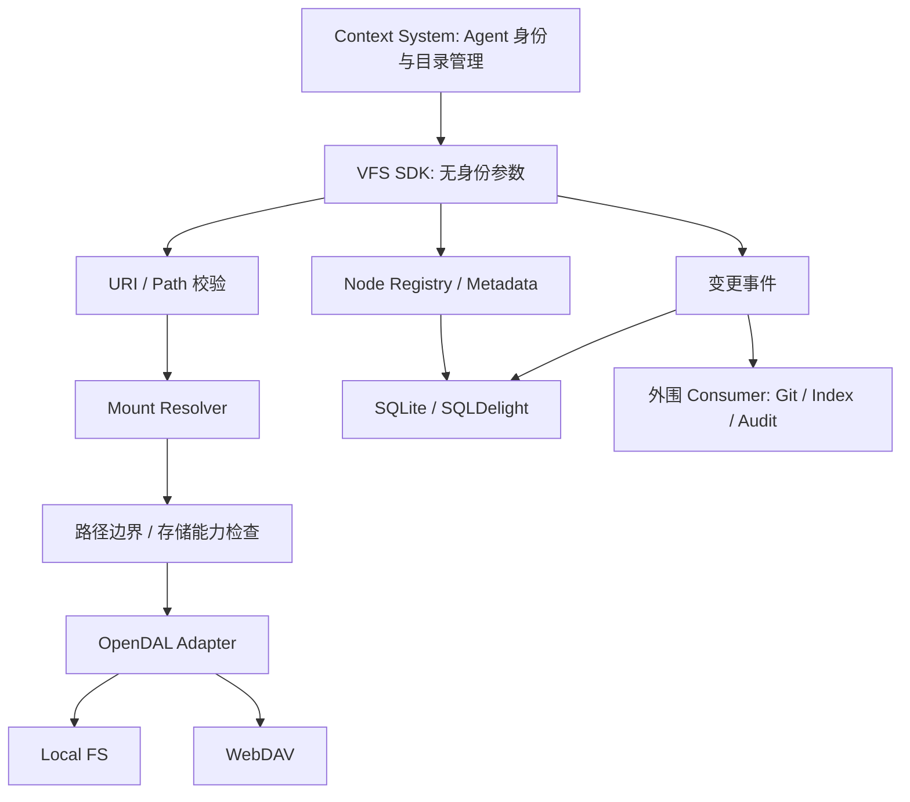

# Alcyone Virtual File System (VFS) 技术设计 v0.2

## 本次修改（2026-09-28，T03 审阅通过）

- 衔接已确认的状态与事务基线，明确懒注册不发布事件。涉及文首衔接说明及第 11 节。

更新时间：2026-09-28  
状态：设计稿，按当前审阅修订；具体接口见 [公共契约草案](VFS_公共契约草案_v0.1.md)。

[T02 文件操作语义](VFS_路径与文件操作语义_v0.1.md) 已获用户确认；本文中仍写作“由 T02 确定”的细节均以该基线为准，包括虚拟目录注册、自动创建父目录和挂载边界。事务与失败报告见已确认的 [T03 状态与事务设计](VFS_状态与恢复设计_v0.1.md)。

## 1. 系统定位

Alcyone VFS 是供个人 Context System 嵌入使用的 Kotlin 文件访问库。通过统一 URI 和 API 访问不同 Storage，隐藏 Local FS、WebDAV 及同步扩展的实现细节。

| 层次 | 职责 |
| --- | --- |
| Context System | Agent 注册与身份绑定、目录分配、共享范围、访问隔离，以及 Memory / Retrieval 等上层能力 |
| VFS | 文件和目录、URI、Node 资源身份、Metadata、Mount、基本 I/O 与事件；恢复为后续优化 |
| Storage Adapter | 通过 OpenDAL 读写实际后端，适配能力和错误 |
| 同步扩展 | 按配置监听事件，执行 Git 等同步、重试和进度记录 |

VFS 提供面向个人 Context System 的文件操作。Context System 限定每个 Agent 可以访问的 URI；VFS 只识别逻辑文件路径，不解释目录属于哪个 Agent。

VFS 不定位为操作系统文件系统或独立网络服务。Node Identity 是资源身份，不能与已移除的调用者身份混淆。

## 2. 核心原则

### 2.1 统一逻辑空间

Context System 使用 `alcyone://memory/` 与 `alcyone://resources/` 组织数据，Agent 专用或共享目录由上层安排。VFS 将目录名称视为普通路径组成部分。

### 2.2 目录由 Storage 推导

目录内容通过 Storage list 推导，不持久化完整目录树。目录需要稳定 Node ID 或 Metadata 时才注册。list 返回 VfsEntry，不批量注册 Node；stat 可懒注册并返回 NodeInfo。

### 2.3 位置与资源身份分离

URI 是位置，Node ID 是 UUIDv7 资源身份。文件与目录都可注册，移动或重命名后 ID 不变；Metadata 绑定 Node ID，随资源保留。

### 2.4 目录级 Mount

Mount Resolver 按路径段边界做最长前缀匹配，计算 StoragePath。首版 Mount 数量较少，使用列表和长度排序即可，不引入 Trie。

### 2.5 文件访问与存储约束

```text
VfsUri / 参数校验 → VfsPath → Mount / StoragePath → 存储约束检查 → Storage I/O
```

存储约束包括路径不能逃逸物理根、后端操作能力、覆盖 / 类型规则。它们与调用者无关。已知不允许的变更应在副作用之前拒绝；需要 stat 才能知道的类型和存在性按操作流程查询。

Node Registry 按 VfsPath 定位资源，按操作需要在 I/O 前后参与查询 / 变更。只查询已注册 Node 或 Metadata 时无需访问 Mount / Storage。

### 2.6 Library First

Core 是纯 Kotlin Library，不引入 HTTP Server 或 Micronaut、Spring Boot、Ktor Server。未来需要网络访问时另增 Adapter。

## 3. URI 与路径模型

| 类型 | 示例 | 位置 |
| --- | --- | --- |
| VfsUri | `alcyone://resources/medical/ct/a.dcm` | 公共 API |
| VfsPath | `/resources/medical/ct/a.dcm` | 逻辑定位 |
| StoragePath | `ct/a.dcm` | 挂载 `/resources/medical/` 后的内部路径 |

不要用裸 String 混淆三种语义；URI 中 memory/resources 不能在解析时被遗漏。规范化、编码、符号链接和物理根边界由 T02 确定。上层 Agent 的目录限制不是物理根边界的一部分，由 Context System 执行。

## 4. Mount 配置

| 逻辑路径 | Storage | 示例用途 |
| --- | --- | --- |
| `/memory/` | Local FS | Memory 文件 |
| `/resources/` | Local FS | 普通资料 |
| `/resources/medical/` | WebDAV | 影像与大文件 |
| `/resources/family/photos/` | WebDAV | 照片 |
| `/resources/alcyone/` | Local FS | 可配置 Git 同步的项目资料 |

挂载与 Agent 无关。嵌套 Mount 列表合并和跨挂载目录操作在 T02 确定；启动配置与数据库记录不一致时的处理在 T03 确定。

## 5. 技术选型

| 领域 | 选型与约束 |
| --- | --- |
| 语言 / JVM | Kotlin，JDK 21+ |
| 异步 | Kotlin Coroutines，API 使用 suspend |
| Storage | Apache OpenDAL Java Binding；首版 Local FS、WebDAV |
| 关键状态 | 独立 SQLite + SQLDelight，不与 Memory 查询库共用 |
| Node / Event ID | UUIDv7 |
| Serialization | 优先 Kotlin Serialization |
| Logging | SLF4J API，由宿主选择日志实现 |
| Event | Coroutine Flow / Channel + SQLite Event Log |
| Git Sync | 外围 Worker 调用 Git CLI |

Core 不直接调用 Local FS / WebDAV / S3 专用接口。Storage Port 只表达 VFS 需要的能力，不另建通用 Storage SPI。OpenDAL 直接嵌入 JVM，无需独立服务；native classifier 的 OS / CPU 适配属于构建发布工作，不进入业务模型。版本组合和后端能力由 T04 验证。

## 6. 整体架构



图中为组件依赖与职责，事件持久化和分发的具体事务顺序由 T03 定义。目录分配不要求增加 VFS Agent 实体。配套图见 [架构与工作流程图](架构与工作流程图.md)。

## 7. 主要流程

### 7.1 读取

解析 URI → 路由 Mount → 检查读取能力与路径边界 → Storage read → 返回字节。read 不要求资源已注册，不更新 Node / Metadata，不产生变更事件。

### 7.2 列表

解析目录 URI → Mount → Storage list → 按已确定的嵌套 Mount 规则形成 VfsEntry 列表。未注册条目的 Node ID 可空；不按 Agent 过滤，也不批量注册目录树。

### 7.3 Node 查询与懒注册

stat(uri) 先按 VfsPath 查询 Registry；已有 Node 可读取逻辑状态，按选项获取 Storage 属性。未注册则经 Mount 和 Storage stat 确认存在后注册 UUIDv7 Node。并发注册必须保持有效路径唯一。

getNode(id) 只查询已注册逻辑记录，未知 ID 返回 Not Found，不通过后端扫描找回身份。

### 7.4 创建 / 写入

URI / 模式校验 → Mount / 能力检查 → Storage write → 创建或更新 Node → 按事务协议记录事件 → 分发。写入失败时不能当作完整成功；后端部分写入或结果不明通过 effect 报告，首版不自动修复。

### 7.5 移动 / 重命名

解析源 / 目标 → 路由两个 Mount → 检查源可读 / 移除、目标可写及覆盖规则 → 必要时注册源 Node → 执行移动 → 更新同一 Node 的逻辑路径与物理映射 → 记录事件。

同 Mount 优先原生 rename / move；跨 Mount 采用 read → write → 确认目标成功 → delete source。目标写入失败保留源；目标完成而源删除失败或 Registry 更新失败时报告错误和实际 effect。不得认为数据库事务能回滚外部 Storage。

目录移动还需处理已注册子 Node 路径及嵌套 Mount 边界。Node ID 与 Metadata 始终保持资源连续性。

### 7.6 删除

URI / 递归选项校验 → Mount / 存储约束 → Storage delete → 按删除策略处理 Node / Metadata → 记录事件。部分删除及状态库失败如实报告；进程中断恢复延后至 E04。

### 7.7 Metadata 与事件

Metadata 查询 / 更新按 Node ID 操作状态库，不访问 Storage。更新成功产生 METADATA_UPDATED。

VFS 仅产生经自身发起的成功状态变更事件；不实现通用 Storage Watch，不保证发现绕过 VFS 的外部文件变化。Consumer 失败不改变已完成的 VFS 操作。

## 8. 关键数据模型

| 模型 | 字段概要 | 说明 |
| --- | --- | --- |
| Mount | id、path、storage、config、created_at、updated_at | OpenDAL 配置由 Adapter 使用；配置中凭据不暴露给普通文件 API |
| NodeIdentity | node_id、type、vfs_path、mount_id?、storage_path?、created_at、updated_at | UUIDv7，类型 FILE / DIRECTORY；有效 vfs_path 建议唯一 |
| NodeMetadata | node_id、tags、description、extensions | 随 Node 保留；由上层解释业务含义 |
| VfsEvent | event_id、event_type、node_id?、uri、payload、created_at、operation_id? | 类型化变更；移动事件含源 / 目标逻辑地址 |
| Consumer 状态 | 消费位置、重试 / 处理状态（后续） | 首版不实现，留到 E05 / E1，不修改原事件表示消费结果 |

SQLite 保存 Node、Mount、Metadata、事件，是关键控制状态，不是可删除重建的缓存。普通文件同步不等于该数据库备份。

VfsEntry / NodeInfo 已确认保留，具体字段以 T01 草案为准。事务与迁移原则按已确认的 T03，具体命名、字段与时间格式在实现中明确。

## 9. Storage 后端与错误

首版支持 Local FS、WebDAV；S3 / MinIO / OSS 等按后续需求增加。调用方使用相同 VFS API，Adapter 处理差异。

操作前判断后端能力，不承诺每个后端都有原子 rename、条件写入或相同列表语义。后端自身只读、拒绝访问或凭据失败时，Adapter 将其转换为存储错误；首版不增加可配置只读挂载。错误转换须区分不支持、只读、后端拒绝、普通 I/O 失败和结果不明；部分失败不可静默报告成功。

## 10. 同步扩展

Git 是 Local FS 特定目录的同步 / 版本管理机制，不是 Storage Backend。

```text
VFS 核心变更 → 持久化事件 → 配置的 Git Sync Worker → Git CLI → 远端仓库
```

SDK / Runtime 按配置连接同步扩展，Context System 只指定需要同步的目录和策略，不手动创建 Worker 或推进游标。Git CLI 复用宿主 SSH、Credential Helper 和代理配置。

Git Sync 单独按 E1 交付，届时定义配置、同步状态查询、重试及关闭行为。write 返回成功不表示远端 push 已完成；Git 失败保留重试状态，不破坏已完成文件操作。初期不承诺双向同步、冲突自动合并或发现全部外部修改。

## 11. Event 机制

事件与逻辑状态一起提交 SQLite，随后通过 Flow / Channel 通知；首版不承诺可靠投递。游标、确认、去重和重放延后至 E05。

不引入 Kafka、RabbitMQ 或 Redis Streams。取消或响应丢失时操作可能已提交，事件是否存在取决于核心提交状态，而非调用方是否观察到成功响应。

## 12. 工程模块

按项目搭建说明组织，不独立创建未来业务模块：

| 模块 | 职责 |
| --- | --- |
| vfs/api | 文件契约、路径、Node、Metadata、事件、异常 |
| vfs/core | 文件编排、Registry、Mount、Metadata、事件及 Port |
| vfs/storage-opendal | OpenDAL Adapter |
| vfs/persistence-sqldelight | 状态库与 Repository 实现 |
| vfs/runtime | SDK 入口、配置、资源生命周期及扩展组装 |
| integration-tests/vfs | 完整 SDK 集成测试 |

依赖方向为 Core → API，Adapter 实现 Core Port，Runtime 组装。Git 扩展模块位置在 E1 确定，不把 Git 业务放入 Core。API 不暴露 Operator / Driver / Repository。

## 13. 对外 API

签名示意，完整选项和结果见 T01：

```kotlin
interface Vfs {
    suspend fun read(uri: VfsUri): ByteArray
    suspend fun write(uri: VfsUri, content: ByteArray): NodeInfo
    suspend fun list(uri: VfsUri): List<VfsEntry>
    suspend fun stat(uri: VfsUri): NodeInfo
    suspend fun getNode(id: NodeId): NodeInfo
    suspend fun move(source: VfsUri, target: VfsUri): NodeInfo
    suspend fun delete(uri: VfsUri)
    suspend fun getMetadata(id: NodeId): NodeMetadata
    suspend fun setMetadata(id: NodeId, metadata: NodeMetadata)
}
```

全部接口无身份参数。Runtime 提供 create(config) 和 close()；上层不用理解具体 Storage API。ByteArray 大小限制与是否引入流式接口在 T04 验证，不能无限读入大文件。

## 14. HTTP 与服务化

第一阶段不提供 HTTP 或独立 Server。若后续需要多设备 / 跨语言远程访问，再单独设计 Adapter，不改变 Core 当前职责；届时网络入口的认证与目录限制属于上层接入边界。

## 15. 技术路线总结

Kotlin Library + OpenDAL Java Binding + SQLite + SQLDelight。SLF4J 不绑定宿主日志实现；Coroutine 不绑定 Web Framework；构建验证 native 平台组合。

## 16. 第一阶段范围

核心交付为 URI / Path、Mount、Local FS / WebDAV、Node Registry、Metadata、SQLite、基本文件操作、标准事件与 SDK；中断与重启恢复延后。Git 同步作为 E1 独立扩展验收。

不实现多用户系统、HTTP Server、分布式部署、MQ、通用 Storage Watch、完整 Secret Management 或海量 Mount 索引。

## 17. 当前设计结论

Context System 决定 Agent 使用哪些文件；VFS 统一访问这些文件；OpenDAL 负责实际 Storage；SQLite 保存资源关键状态；外围 Worker 处理可配置的同步。文件模型保持独立于 Agent 身份和后端实现。

## 18. 版本记录

- 2026-09-27 / T01 第三轮：职责收敛为统一文件系统，调整模块和流程，明确同步接入边界；保留已有资源身份与存储技术路线。
- v0.2 / 2026-09-26：确定 Kotlin / JDK、Library First、OpenDAL、SQLDelight、UUIDv7、路径分层及事件扩展方向。
- v0.1：建立 VFS、Mount、Node 和 Storage 基础模型。
