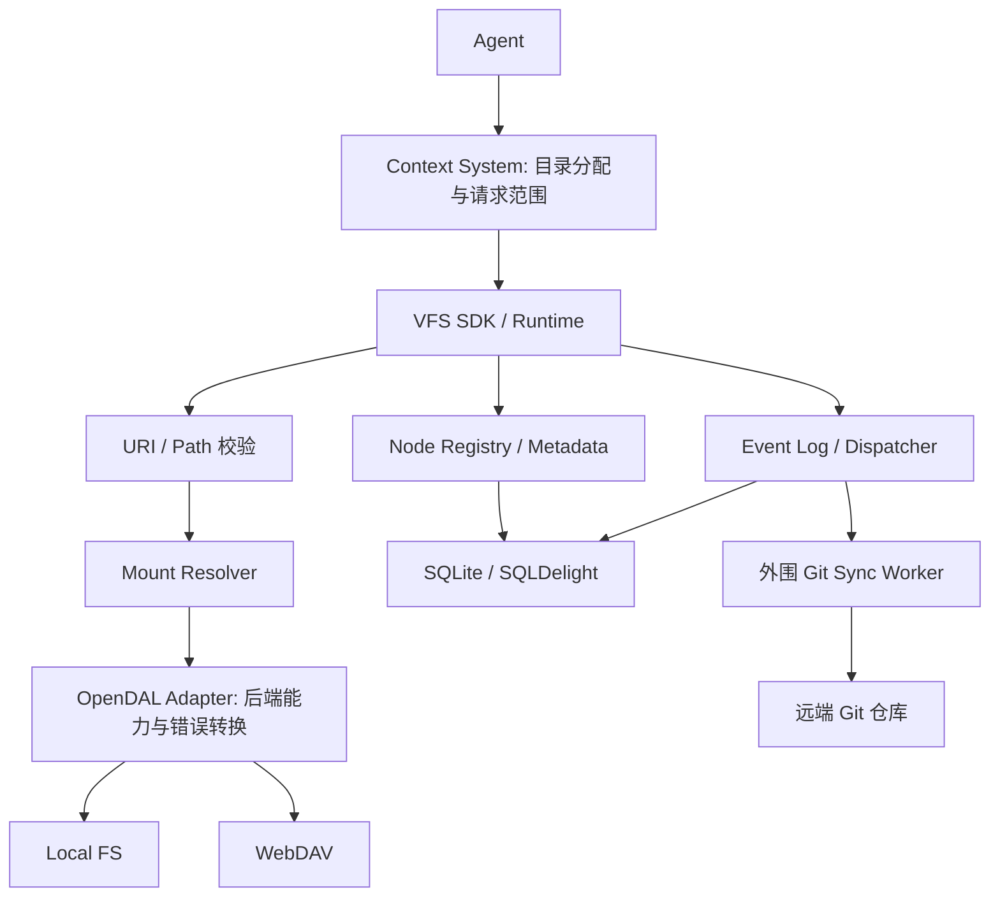
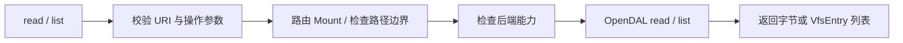
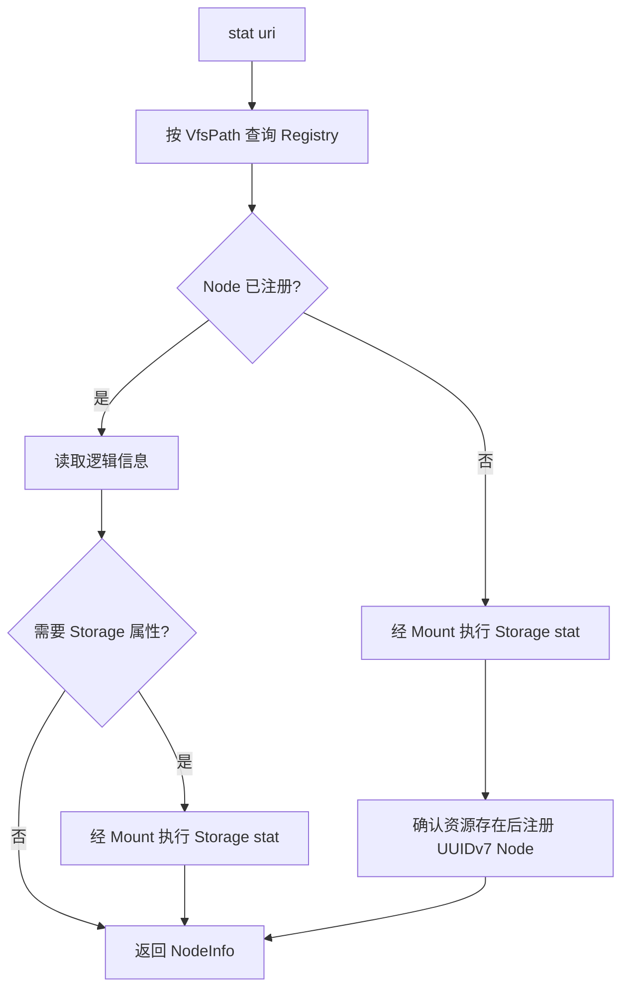

# Alcyone VFS 架构与工作流程图

## 本次修改（2026-09-28，恢复能力延后）

- 首版不实现文件操作中断恢复、自动补偿或重启修复；保留基本失败报告与状态事务。涉及文件操作流程与跨 Mount 移动说明。
- 可靠事件重放与持久化消费进度列为后续优化，相关实现和验收不再阻塞首版。

本图与 [技术设计](Alcyone_Virtual_File_System_VFS_技术设计_v0.2.md)、[公共契约草案](VFS_公共契约草案_v0.1.md) 配套；描述设计目标，不代表已经实现。

## 1. 核心原则

- Context System 管理各 Agent 的目录及共享范围，向 VFS 传入具体文件操作。
- VFS 使用统一 URI 屏蔽后端差异；Node ID 表示稳定的资源身份。
- 目录内容从 Storage 推导；list 不批量注册 Node，stat 可懒注册。
- Mount 使用路径段边界的最长前缀匹配。
- 同步扩展独立消费事件，文件操作成功不等于远端同步已经完成。

## 2. URI 与路径

```text
VfsUri       alcyone://resources/medical/ct/a.dcm
VfsPath      /resources/medical/ct/a.dcm
Mount        /resources/medical/
StoragePath  ct/a.dcm
```

## 3. Mount 示例

| 逻辑路径 | 后端 | 用途 |
| --- | --- | --- |
| `/memory/` | Local FS | Memory 文件 |
| `/resources/` | Local FS | 普通资料，可配置外围 Git 同步 |
| `/resources/medical/` | WebDAV | 医疗影像 |
| `/resources/family/photos/` | WebDAV | 照片 |
| `/resources/alcyone/` | Local FS | 项目资料 |

## 4. 整体架构



此图表示组件关系。事件和逻辑状态的事务顺序由 T03 定义；Git 扩展按 E1 交付。Git 处理配置的本地目录，不作为 Storage Backend。

## 5. 主要流程

### 5.1 读取与列表



read / list 不要求 Node 已注册，不产生变更事件。列表项的 Node ID 可以为空。

### 5.2 Node 查询与懒注册



getNode(id) 只查询逻辑记录，不扫描 Storage 或懒注册未知 ID。并发懒注册应保持同一有效路径的身份唯一。

### 5.3 变更与同步

```text
write / move / delete
    → 校验参数、路径、后端能力与操作规则
    → 执行 Storage 操作
    → 在同一数据库事务中更新 Node / Metadata 与事件
    → 返回核心操作结果

持久化事件 → 配置的同步 Worker → 成功记录 / 失败重试
```

跨 Mount 移动采用读取源、写入目标、确认成功、删除源，更新同一 Node 的映射。部分失败返回错误及 effect，首版不自动恢复。Metadata 查询 / 更新只访问状态库。

## 6. 关键数据模型

| 模型 | 核心内容 |
| --- | --- |
| Mount | 逻辑挂载路径、后端类型及配置 |
| Node | UUIDv7、FILE / DIRECTORY、当前 VfsPath 与物理映射 |
| Metadata | Node ID、tags、description、extensions |
| Event | UUIDv7、事件类型、Node ID、逻辑位置、操作关联信息 |

SQLite 保存关键状态，不能当作缓存删除。普通文件同步不等同于该数据库备份。

## 7. 后端与扩展

首版使用 OpenDAL 的 Local FS / WebDAV。S3、MinIO、OSS 等按后续需求扩展。

首版不增加可配置只读挂载开关；后端自身只读、凭据失败或操作不支持时，Adapter 如实转换错误。统一接口不承诺所有后端具有相同原子操作能力，也不承诺通用双向同步或自动冲突合并。
